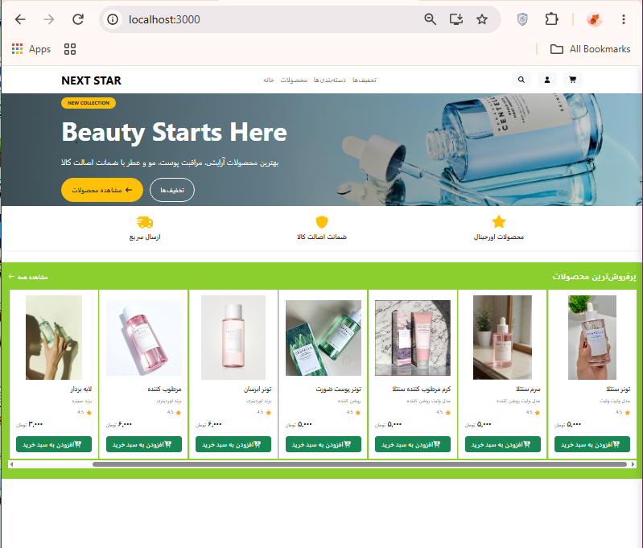

# 🛒 Online Shop

A backend-focused e-commerce application built with **ASP.NET Core** using **Clean Architecture, CQRS, MediatR, Entity Framework Core, and SQL Server**.

## 🚀 Overview

Online Shop is an e-commerce backend project designed with a clean and maintainable architecture.

The project provides APIs for managing products and shopping baskets and demonstrates modern backend development practices with .NET.

## 🛠️ Technologies

* **.NET 8 / ASP.NET Core**
* **C#**
* **Entity Framework Core**
* **SQL Server**
* **CQRS**
* **MediatR**
* **Clean Architecture**
* **Repository Pattern**
* **RESTful APIs**
* Otp_Token
* **Swagger / OpenAPI**

## 🏗️ Architecture

The project follows a layered architecture inspired by **Clean Architecture** principles.

```text
Online Shop
│
├── Shop.Domain
│   └── Entities
│
├── Shop.Application
│   ├── Commands
│   ├── Queries
│   ├── Handlers
│   ├── Responses
│   └── Interfaces
│
├── Shop.Infrastructure
│   ├── Data
│   ├── Repositories
│   ├── Configurations
│   └── Migrations
│
└── Shop.presentation
    ├── Controllers
    ├── Program.cs
    └── Configuration
```


## 👩‍💻 Author

**Zeinab**

## 📸 Project Preview



Backend Developer | ASP.NET Core | C#

---

⭐ If you find this project useful, feel free to explore the repository.
